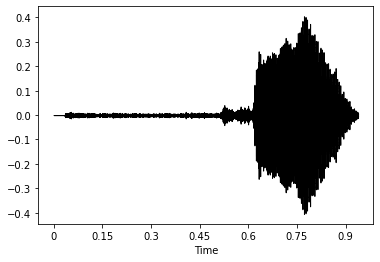
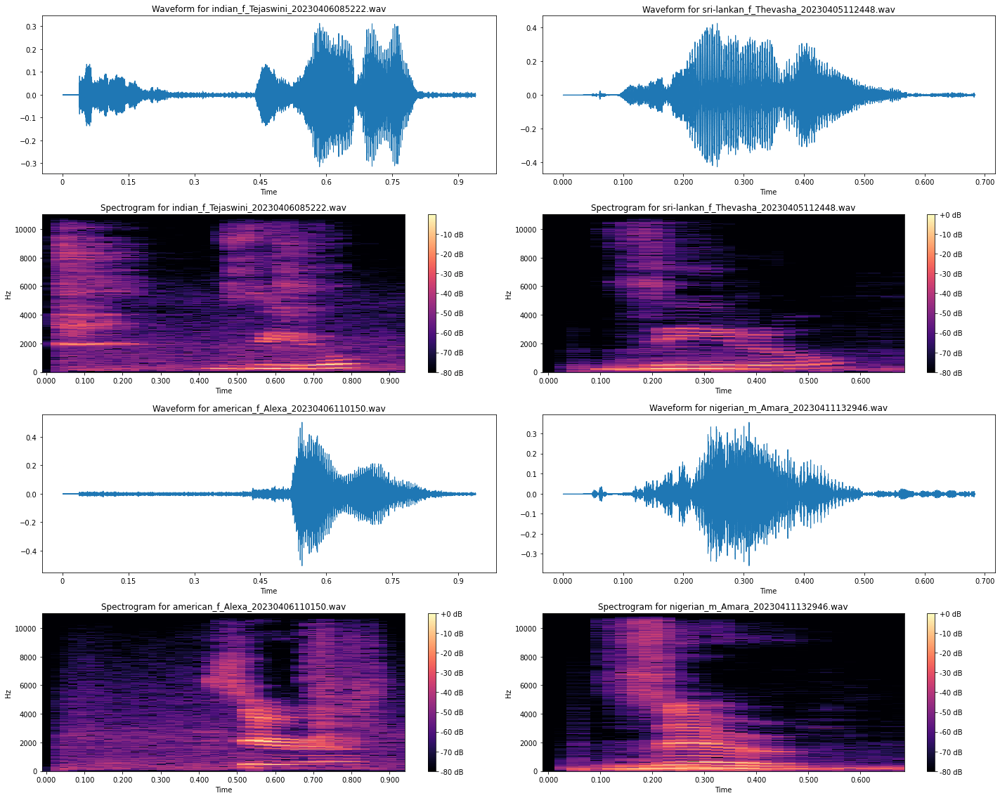

## Project


# Audio Classification.(Machine Learning and Deep Learning)

The goal of audio classification is to enable machines to automatically recognize and distinguish between different types of audio. In this project we have collected the audio's of different samples from different nationality. 
- Collection of audio through a web interface. 
- Exploratory Data Analysis of Audio data.
- Data Preprocessing.
- Audio Classification Model Creation.
- Testing Some Test Audio Sample.


## Authors
- [Siva Ram](https://github.com/KSiva199)
- [Nipuni Senani](https://github.com/NipuniSdSR)


## Technogies Used

**Programming Language:** Python, Flask, JavaScript and PHP

**Machine Learning Model:** PCA and Support Vector Machine

**Deep Learning:** Convolutional Neural Networks


## Installation
Clone or download repository to run.
- **Packages require:** Tensorflow, Scikit-Learn, Librosa, Pandas, Numpy, Glob, PIL, Matplotlib, Requests, BeautifulSoup, OS, Seaborn  
    
## Processing

```python
import librosa as librosa
import os
path = "/Users/ksr/Machine Learning/Final Project Audio/audio/4"
y,sr=librosa.load('audio/0/american_f_Alexa_20230406110149.wav',sr=32000)
librosa.display.waveshow(y,sr=sr,color='black')
```


```python
import librosa as librosa
import numpy as np
from matplotlib import pyplot as plt
import os
path = "/Users/ksr/Machine Learning/Final Project Audio/audio/0"
dir_list = os.listdir(path)
spectrograms = []
waveforms = []
for file in dir_list:
    actual='audio/0/'+file
    y, sr = librosa.load(actual)
    waveforms.append(y)
    spectrogram = librosa.stft(y)
    spectrograms.append(spectrogram)
for i, (waveform, spectrogram) in enumerate(zip(waveforms, spectrograms)):
    plt.figure(figsize=(10, 8))
    
    # plot waveform
    plt.subplot(211)
    librosa.display.waveshow(waveform, sr=sr)
    plt.title(f'Waveform for {dir_list[i]}')
    
    # plot spectrogram
    plt.subplot(212)
    librosa.display.specshow(librosa.amplitude_to_db(np.abs(spectrogram), ref=np.max),
                                y_axis='linear', x_axis='time') 
    plt.title(f'Spectrogram for {dir_list[i]}')
    plt.colorbar(format='%+2.0f dB')
    
    plt.tight_layout()
    plt.show()
```



